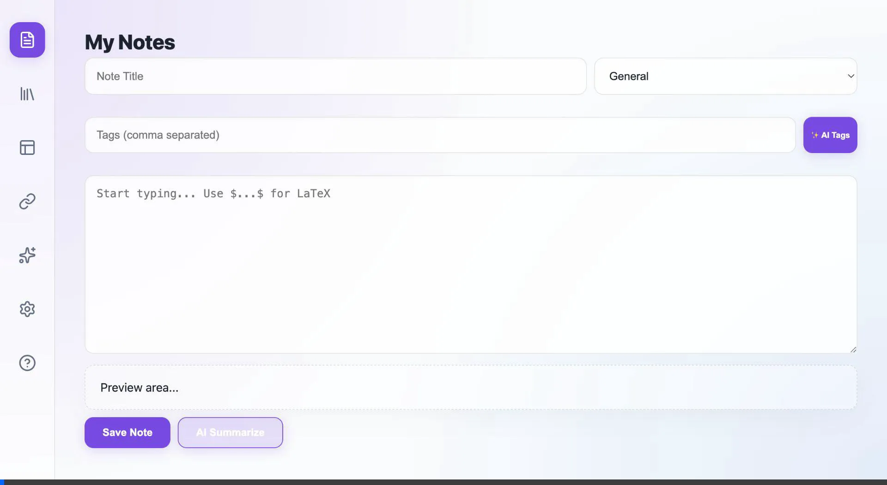

# 🕶️ Glass AI Note Taker

A premium, standalone Chrome Extension designed for AI researchers and engineers. Featuring a stunning **Light Mode Glassmorphism** aesthetic, real-time **LaTeX rendering**, and structured **AI Project Organization**.

## 🎥 Feature Demo

## ✨ Core Features

### 🏢 Standalone App Experience
Unlike standard extensions, Glass AI Note Taker opens as a **full-screen standalone tab**, providing a professional-grade IDE workspace for your research logs and mathematical proofs.

### 💡 Premium Light Theme
- **Aesthetic**: Minimalist glassmorphism with soft blurs, bright surfaces, and vibrant cosmic gradients.
- **Performance**: Optimized for long-form writing and heavy documentation.

### 📐 Advanced LaTeX Support
Engage with mathematical research effortlessly. Support for both inline (`$ ... $`) and block (`$$ ... $$`) math using **KaTeX**.
> Example: `$\int_0^\infty e^{-x^2} dx = \frac{\sqrt{\pi}}{2}$`

### 📁 Smart Organization
- **Library & Folders**: Manage notes in a structured tree view.
- **AI-Powered Tagging**: Automatically generate 3-5 relevant tags for your notes using OpenAI.
- **Link Quick-Store**: Use `Cmd/Ctrl + Shift + L` to instantly save the current tab's link into your library.

### 🤖 AI Integration
- Connect your **OpenAI API Key** in Settings.
- **Summarize Feature**: Condense long research papers or meeting notes into concise summaries with one click.
- **Templates**: Pre-built templates for **AI Research**, **System Architecture**, and **Prompt Engineering**.

## 🚀 Installation & Setup
1. Clone this repository.
2. Open Chrome and go to `chrome://extensions`.
3. Enable **Developer mode** (top right).
4. Click **Load unpacked** and select the folder containing this project.
5. Click the extension icon in your toolbar to launch the standalone app!

## 🛠️ Tech Stack
- **Architecture**: Chrome Manifest V3, Background Service Workers.
- **UI**: Vanilla JS, HTML5, CSS3 Glassmorphism.
- **Libraries**: KaTeX (Math), Lucide (Icons), OpenAI API.

---
Created with ❤️ for AI Engineers.
